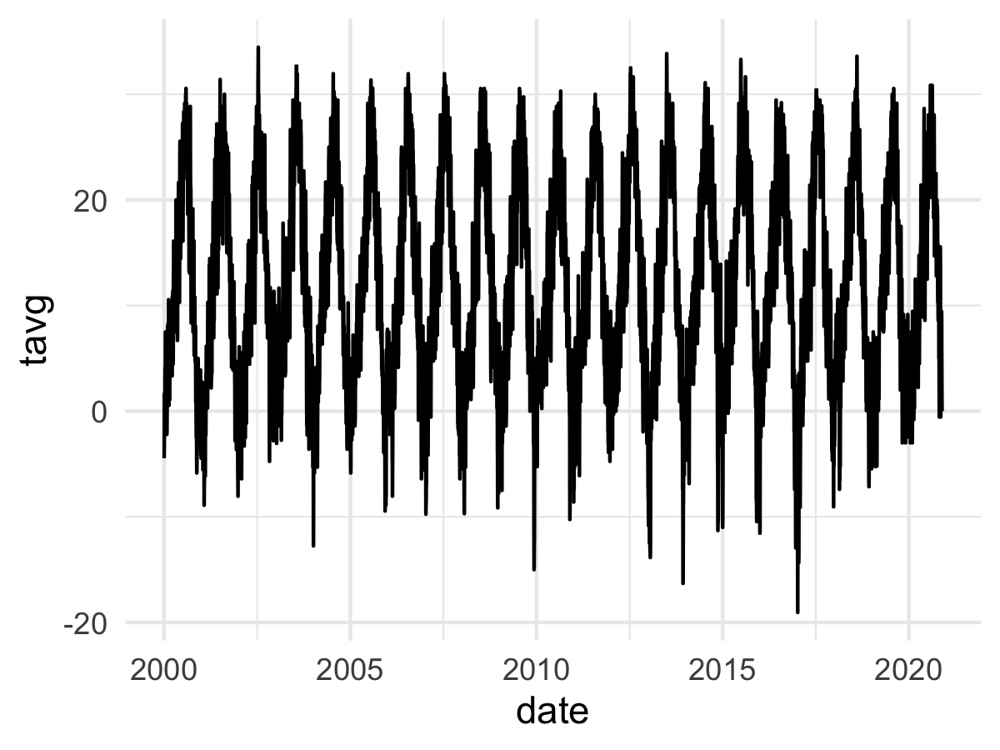

# rnoaa_helper
Functions to bypass rnoaa data limits for longer time-series requests

# 1. Load libraries, source functions, and enter your rnoaa key

``` r
library(tidyverse)
library(rnoaa)
library(lubridate)

source(here::here('rnoaa_functions.R'))
options(noaakey = '***')
```

# 2. Provide years and station ID

``` r
# data from 2000-2020, Boise airport
years <- seq(2000, 2020, 1)
station_id <- 'GHCND:USW00024131'
```

# 3. Request data with rnoaa_helper()

``` r
# tibble with tmin, tmax, and tavg (plus month, year, date and station)
rnoaa_weather_dat <- rnoaa_helper(years, station_id)

# plot
rnoaa_weather_dat %>%
  ggplot() +
  geom_line(aes(date, tavg)) +
  theme_minimal()
```



